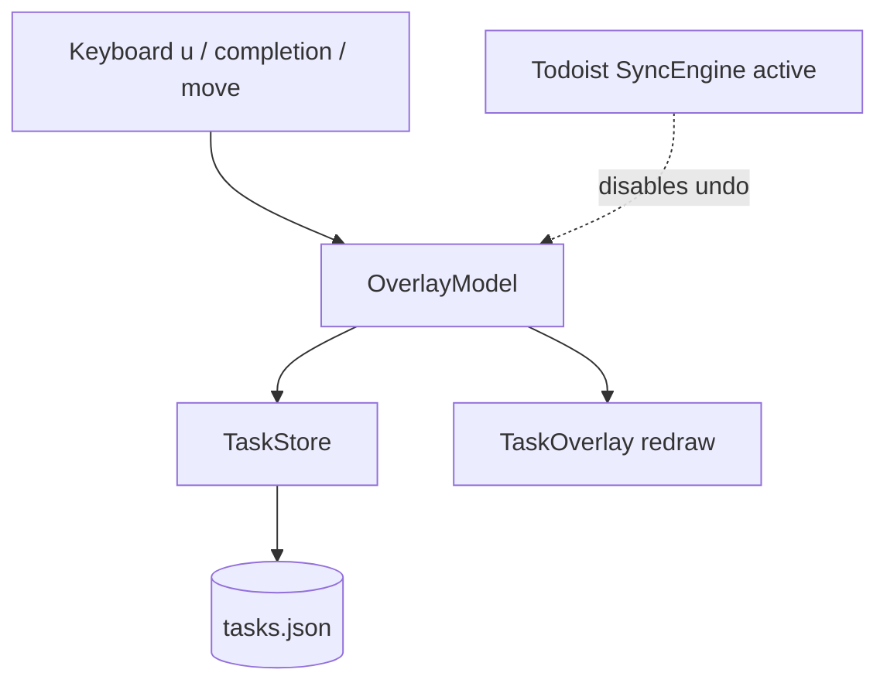

# Architecture: Local Task Undo

## System Overview

Undo remains wholly inside the existing Qtile process. `TaskStore` owns the
mutation and restoration rules; `OverlayModel` owns one session-local undo
record and routes both keyboard completion/move and mouse completion through
the same action path. `TaskOverlay` redraws the result and reports the
local-only availability in its hint.

## Technical Decisions (ADRs)

### ADR-008: One transient undo record at the task-store seam

**Status**: Proposed

**Context**: The model currently invokes store mutations directly, while mouse
completion bypasses the model. Capturing reversal logic in both callers would
diverge and would make task-list restoration difficult to test without Qtile.

**Decision**: Add a small `UndoAction` value object and a single
`TaskStore.undo(action)` interface. Successful `complete()` and `move()` calls
return the record needed to reverse their local mutation. `OverlayModel` keeps
only the latest returned action and clears it after a successful undo. Both
keyboard and mouse completion call one model method that records the action.

**Consequences**: The store remains the deep module: callers need only perform
an action or undo its returned record, while list lookup, timestamp clearing,
atomic persistence, and duplicate prevention stay local. The undo record is
not serialized and vanishes on restart. Existing callers migrate to the
returned-action interface; no compatibility shim remains.

**Alternatives Considered**: Store raw task/list tuples in `TaskOverlay`
(rejected: mouse and keyboard paths diverge, and Qtile-only tests would own
store invariants); a persisted stack (rejected: PRD excludes cross-restart and
multi-step undo); separate reopen/move-back methods (rejected: a wider,
operation-specific interface exposes implementation detail to the model).

---

### ADR-009: Disable undo whenever Todoist sync is active

**Status**: Proposed

**Context**: The sync engine write-throughs completion and moves. A local
restore without a matching remote command will be overwritten by reconciliation
and falsely appear successful.

**Decision**: `OverlayModel` does not retain or execute undo actions when
`TaskStore.engine` is set. `u` is a safe no-op in that state; the hint marks
undo as local-only.

**Consequences**: The feature is coherent and needs no remote-command research
or sync queue changes. Synced users cannot reverse actions through this feature.

**Alternatives Considered**: Queue a compensating Todoist command (rejected by
approved PRD: cloud undo is out of scope); allow local-only restore while sync
runs (rejected: next refresh can erase the restored task).

## System Design

## Data Models

`UndoAction` is an in-memory value object:

| Field | Meaning |
|-------|---------|
| `kind` | `complete` or `move` |
| `task_id` | Existing task identifier |
| `source` | Today or Inbox list before the mutation |

It is never written to `tasks.json`; the existing version-1 task file is
unchanged.

## Interface Design

`TaskStore` exposes the narrow mutation interface:

- `complete(task_id) -> UndoAction | None`
- `move(task_id) -> UndoAction | None`
- `undo(action) -> bool`

`undo()` locates the affected task, reverses only the stated local mutation,
persists atomically, and returns whether it applied. `OverlayModel` is the only
caller that retains an action. Its interface adds a mouse-safe completion
method and handles `u` in navigation mode.

## Test Strategy

| Level | Approach | Coverage |
|-------|----------|----------|
| Unit: store | `tmp_path` JSON store | Completion undo resets timestamp/restores list; move undo restores source; missing action leaves data unchanged. |
| Unit: model | Pure keysym model | `u` acts only for local action, clears the record, replaces prior record after another mutation, and is inert with sync enabled. |
| Live Qtile | Local-only store | Complete, undo, move, undo; observe list/counter/hint and restart persistence. |

## Risks & Mitigations

| Risk | Impact | Mitigation |
|------|--------|------------|
| Click bypasses undo recording | High | Route it through the same model method as `d`. |
| A stale action duplicates a task | High | `undo()` locates by ID and returns false without mutation when state no longer matches. |
| Sync overwrites an apparent restore | High | Disable undo while `engine` exists. |
| Selection points outside visible rows | Medium | Existing clamp runs after every mutation and redraw. |

## Dependencies

- Existing stdlib JSON persistence and `TaskStore` atomic save.
- Existing Qtile Popup/model key handling.
- No new dependency, daemon, IPC, persistence schema, or Todoist command.
