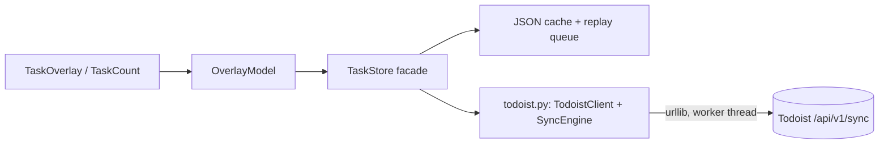

# Architecture: Todoist Client Sync

Parent: [PRD: Todoist Sync](prd-todoist-sync.md) (approved 2026-09-08)
Review: round 1 FAIL, round 2 FAIL — v3 retargets Unified API v1 and fixes
all open findings; round 3 pending.

## Context

The task overlay runs inside the Qtile process (`task_widget.py` +
`tasks.py`), is daemonless, and must never block the bar on network I/O.
**Todoist REST v2 and Sync v9 were sunset 2026-02-10**; the target is the
**Unified API v1** at `https://api.todoist.com/api/v1`. The Qtile venv has
no `requests` — stdlib `urllib.request` only.

Key v1 properties this design relies on (all verified against
developer.todoist.com/api/v1 on 2026-09-08):

- Single endpoint `POST /api/v1/sync` serves reads and writes.
  - Reads: form fields `sync_token` (`*` = full) and
    `resource_types` (e.g. `["items", "user"]`). Responses carry a new
    `sync_token` for incremental sync, plus `items` and `user`
    (including `user.inbox_project_id`).
  - Writes: `commands` array; each command has a `type`, a client
    **`uuid`** (retries with the same uuid are safe — documented
    idempotency), optional **`temp_id`** for creates, and `args`.
    The response's `temp_id_mapping` resolves temp ids to real ids, and
    commands in the same batch may reference earlier temp ids.
  - Task commands: `item_add`, `item_update` (due changes),
    `item_complete`, `item_close` (what official clients do: completes
    regular tasks, advances recurring ones).
- **No completed-items listing exists in v1** (`completed/get_items` is
  gone; only aggregate `completed_info` counts) → Done section is sourced
  from the local completion log (spec amendment; see ADR-007).

## Components



### Storage format & migration (fixes round-2 blocker)

**Additive only**: the current on-disk object keeps its existing keys;
new state rides in new optional keys.

```json
{
  "version": 1,
  "today":  [...],
  "inbox":  [...],
  "completed": [...],
  "sync": {
    "queue": [
      {"cmd": "item_add", "temp_id": "<local-uuid>", "uuid": "<cmd-uuid>",
       "args": {"content": "...", "project_id": "..."}},
      {"cmd": "item_close", "uuid": "<cmd-uuid>",
       "args": {"id": "<local-uuid-or-real-id>"}}
    ],
    "token": "<sync_token or null>",
    "revision": 7
  }
}
```

- `load()`: missing `sync` key → defaults (empty queue, `token: null`,
  revision 0). A pre-migration file loads **with all its tasks intact**
  and is never quarantined (`.corrupt` remains only for unreadable JSON).
- `save()` without an engine attached writes exactly the pre-Todoist
  key set (`sync` omitted when untouched) — old builds remain
  read-compatible.
- Task dicts may carry an optional `"origin": "todoist"` (absent =
  local). Regression tests assert pre-migration tasks **survive** load,
  not merely that loading doesn't error.

### `src/qtile_pomodoro/todoist.py` (new)

- **`TodoistClient`** — stdlib HTTP wrapper around `POST /api/v1/sync`:
  `_sync(payload)` with 8s timeout, Bearer token, form-encoded body,
  JSON response. Maps transport/HTTP/parse failures to `TodoistError`;
  no in-place retry (the queue is the retry).
  - `read()` → `{"items": [...], "user": {...}, "sync_token": ...}`;
    always requests a **full sync** (`sync_token: "*"`) — refreshes are
    user-initiated + on-write at single-user scale, and set-replacement
    reconcile (below) needs the complete item set.
  - `send(commands)` → applies a batch; returns `temp_id_mapping` and
    per-uuid `sync_status`; a `sync_status` of `"error"` for a command
    raises `CommandError(uuid)` after the batch (other commands still
    applied — server processes the batch).
- **`SyncEngine`** — cache ↔ Todoist coherence. All HTTP in one worker
  `threading.Thread`; a `threading.Lock` guards only in-memory cache/queue
  mutation + file writes (never spans network).
  - `refresh()` (worker):
    1. under lock: snapshot queue, clear `dirty` flag
    2. if queue non-empty: send the **whole queue as one batch** (each
       entry keeps its stable command uuid; retries are idempotent).
       Offline `item_add`s use `temp_id` = the local task id; later
       queued commands reference that temp id directly (same-batch
       resolution) or the mapped real id (later batches). On success,
       apply `temp_id_mapping` under lock: rewrite the task id **and any
       remaining queued args referencing it**, drop applied entries.
       On `CommandError`: drop the offending entry only if the error is
       permanent (unknown id / already completed — `item_close` on a
       closed task is a no-op success), else keep the whole batch for
       the next refresh.
    3. `read()` (full sync every refresh). Local tasks marked `checked`
       or `is_deleted` in the fetched set are treated as done/gone —
       excluded from the lists, and dropped from the cache (they were
       completed or deleted in another client).
    4. reconcile under lock (rules below), persist, bump `revision`
    5. if `dirty` was set during the run → chain another refresh
  - `enqueue(cmd, local_apply)` (UI thread): under lock — apply to cache,
    append with a fresh command uuid, set `dirty`, persist; then kick a
    worker if idle.
  - UI completion notification: `qtile.call_soon_threadsafe(callback)`
    (never `timeout_add` from a thread); overlay registers its callback
    behind an `alive` flag cleared on close.
  - Queue hygiene: max 100 entries; overflow drops newest and shows `!`.
- **Mapping rules** (from sync `items` + `user.inbox_project_id`):
  - Inbox list = items whose `project_id` == `user.inbox_project_id`
  - Today list = items with `due.date` <= today (overdue included, in
    the spirit of Todoist's Today view)
  - `add(today=False)` → `item_add` (+ `due: {"string": "today"}` when
    targeting Today — the documented v1 `due` object; exact shape also
    pinned by the story-1 live probe)
  - `complete` → `item_close`; `move` → `item_update` due today/clear
    (exact due-arg shape pinned by a live API probe in story 1)
  - Done section = local `completed` log (overlay completions), capped
    as today; refreshes do not rewrite it.

### Reconcile rules

- Fetched items **replace** the `todoist`-origin cache entries in the
  two lists (full-sync set replacement, valid because reads are always
  full); fetched items with `checked` or `is_deleted` set are excluded
  and their cache entries dropped. **`local`-origin tasks survive**
  until their queued `item_add` replays or the user completes them.
- Tasks under pending queued commands are shielded from overwrite.
- `completed` (Done) is append-only from local actions; completed_at
  timestamps preserved.

### `tasks.py` / `task_widget.py` / config (as round 2)

Facade with unchanged public surface + `pending_count` /
`refresh_async(cb)`; overlay gets `↻N`/`!` header indicator and an `r`
force-refresh key; bar widget unchanged; token in
`config.toml [tasks] todoist_api_token`, absent → engine absent,
byte-identical local behavior. Invalid token: refreshes fail, queue
capped, persistent `↻N` is the visible signal.

## ADRs

### ADR-006: single /api/v1/sync endpoint, batched commands

**Status**: Accepted
**Context**: v1 unified the APIs; batching is native; command uuids give
documented retry idempotency; temp ids give server-side create remapping.
**Decision**: All reads and writes go through `POST /api/v1/sync`. Queue
drain = one batch. Creates use `temp_id` = local task id.
**Consequences**: One HTTP round-trip per refresh; no duplicate creates
on retry; offline create→complete resolves inside the batch. Reads are
always full syncs (no incremental-token tombstone logic); one account
with tens of tasks makes this cheap.
**Alternatives**: REST-style per-resource endpoints (more round-trips,
no batch temp-id resolution); keeping REST v2 (sunset — impossible).

### ADR-007: Done section from local completion log

**Status**: Accepted
**Context**: v1's documented surface has no completed-items listing
(`completed/get_items` was removed; only count aggregates remain).
**Decision**: The Done section lists completions made through the overlay
(local `completed` log, already persisted). Tasks completed in other
Todoist clients drop off the overlay lists on refresh (correct — they're
done) but don't join the Done section.
**Consequences**: No extra API dependency; Done is exactly "what I
finished from this desk". If v1 grows a completed-items endpoint later,
this is a drop-in swap behind `TaskStore.completed`.
**Alternatives**: daily full-archive queries via productivity stats
(rejected: aggregate counts only, no titles).

## Edge Cases

- First run with token: `read("*")` populates; pre-existing local tasks
  survive (merge rule) and their queued `item_add`s replay.
- Invalid token mid-session: every refresh raises `TodoistError`; cache
  + queue untouched and usable; `↻N` persists.
- Overlay open during refresh: cache renders immediately; revision bump
  triggers guarded redraw; closed overlay → callback dropped.
- Qtile restart with queued commands: queue persisted; next open drains
  first (stable uuids make the redrain safe).

## Testing Strategy

- `tests/test_todoist.py`: `TodoistClient` against stubbed urllib
  (request shape: form fields, Bearer header; error mapping; batch
  response parsing). `SyncEngine` with a fake client: batch drain,
  temp-id mapping rewrite of later queued args (round-2 blocker
  regression), permanent-vs-transient command errors, dirty chaining,
  reconcile merge/shield, queue cap, lenient load of pre-migration
  files with tasks surviving (round-2 blocker regression).
- Existing 20 tests untouched and passing = no-token contract.
- Story 1 includes a live API probe (one real read + one item_add/close
  on a scratch task) pinning the exact `item_update` due-arg shape and
  sync response fields; results recorded in the story.
- Live smoke (user): add/complete in overlay ↔ Todoist web; offline
  create→complete replay; restart with queued ops.

## Story Breakdown (proposal)

1. `TodoistClient` + live API probe + unit tests (stubbed transport).
2. `SyncEngine` + storage migration + queue/reconcile tests.
3. Widget wiring (`↻N`, `r` key, refresh-on-open) + live smoke.
