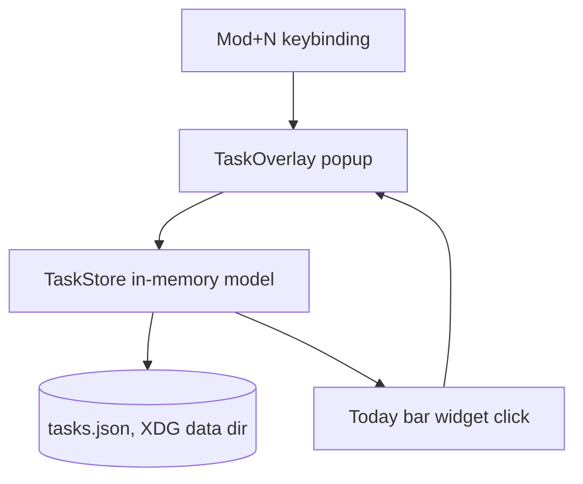

# Architecture: Minimal Qtile Task Overlay

## System Overview

The task feature lives entirely inside the Qtile process as two new modules of
the existing `qtile_pomodoro` package: a pure-Python task store and a Qtile
integration module providing a bar counter widget and a popup task overlay.
There is no daemon, no IPC socket, and no dependency on the Pomodoro Timer
Service. All task mutations happen in the Qtile process and persist to a
single local JSON file.



## Technical Decisions (ADRs)

### ADR-001: Qtile-process-resident, daemonless task feature

**Status**: Accepted

**Context**: The Pomodoro timer uses a daemon because it must run and notify
during full-screen breaks regardless of bar/widget lifecycle. Tasks have no
such requirement: every interaction is user-initiated while Qtile is running.

**Decision**: Implement task state and UI inside the Qtile process. No
daemon, no socket protocol, no CLI round-trips for mutations.

**Consequences**: No process lifecycle management; state dies with Qtile but
persists via JSON. No notification ability (accepted: PRD excludes
reminders). Mutations from outside Qtile (e.g., a shell one-liner editing the
JSON) are visible on next poll but not concurrently coordinated.

**Alternatives Considered**: Reuse the Timer Service daemon and socket
(rejected: needless architecture for user-initiated-only interactions);
external tool like rofi for input (rejected: PRD requires a Qtile function
with minimal dependencies).

---

### ADR-002: Single JSON file for task persistence

**Status**: Accepted

**Context**: PRD requires local persistence surviving Qtile restarts. The
task volume is tens of items; the sole writer is the Qtile process.

**Decision**: Persist to `$XDG_DATA_HOME/qtile-pomodoro/tasks.json`,
rewritten atomically (write temp file + `os.replace`) on each mutation.

**Consequences**: Human-readable and diff-able; trivially backed up. No
query capability (not needed at this scale). Diverges from the timer's
SQLite store — acceptable because the stores are owned by different
lifecycles (Qtile process vs. daemon).

**Alternatives Considered**: SQLite table in the timer store (rejected:
couples task feature to the Pomodoro daemon's database and its writer
process).

---

### ADR-003: Popup-based overlay with custom key handling

**Status**: Accepted

**Context**: Qtile's `Popup` internal windows receive keyboard events when
focused (proven by the Break Overlay resume gate). Text entry on a popup has
no built-in support; Qtile's `Prompt` is a bar widget, not embeddable.

**Decision**: The TaskOverlay is a centered `Popup` (≈700×420 on the current
screen) that renders: Today list, Inbox list, a selection cursor, and a
one-line input editor. A minimal line editor is implemented over
`process_key_press` (printable keys append, Backspace deletes, Enter
commits). Keys: `j/k` move selection (clamped to visible rows; the selected
row carries a filled highlight bar), `d` completes the selected task
(Space is deliberately inert in nav — single-key completion caused accidental
removal; user decision 2026-09-04), `m` moves it between lists, `Tab` switches the
add-target (Inbox↔Today), any other printable key starts typing immediately, `Enter` adds the typed task to the target,
`Esc` backs out of input mode first, then closes; `Mod+N` toggles.

**Consequences**: Keyboard-first with mouse click regions mirroring the
Break Overlay's bottom-control pattern. Custom editor means no IME/complex
input — acceptable for quick capture. Risk: keysym handling must match the
X11 `process_key_press` contract (already exercised in this codebase).

**Alternatives Considered**: Rofi-driven menus (external dependency);
bar `Prompt` widget (input visible only in the bar, list not shown).

---

### ADR-004: Same package, separate modules

**Status**: Accepted

**Context**: The feature ships inside the `qtile-pomodoro` package the
Qtile environment already imports.

**Decision**: New modules `qtile_pomodoro.tasks` (pure store/model, no
Qtile imports) and `qtile_pomodoro.task_widget` (bar counter + overlay).
Timer code is untouched.

**Consequences**: One install, one integration point. The store module is
pure stdlib and unit-testable without a running Qtile.

**Alternatives Considered**: A separate Python package (rejected: second
install target and skill pair for a sibling feature of the same Qtile
setup).

---

## System Design

Components:

- `qtile_pomodoro.tasks`
  - `Task` (dataclass): `id: str`, `title: str`, `created_at: ISO-8601`, `completed_at: ISO-8601 | None`.
  - `TaskStore`: loads/saves `tasks.json`; holds `inbox: list[Task]`,
    `today: list[Task]`, `completed: list[Task]` (hidden, retained);
    mutation methods `add(title, target)`, `complete(task_id)`,
    `move(task_id)`, each persisting immediately; `today_count` property.
- `qtile_pomodoro.task_widget`
  - `TaskCount(base.InLoopPollText)`: polls the store (file mtime check,
    default 1 s interval), renders `Tasks:N` where N = incomplete Today
    count; `button_press` on button 1 toggles the overlay.
  - `TaskOverlay`: owns one module-level `TaskStore` instance (lazily
    created, shared with `TaskCount`), builds the popup on open, redraws on
    each mutation, kills the popup on close.
- `~/.config/qtile/config.py`: `Mod+N` keybinding calling the overlay
  toggle; `TaskCount()` added to the bar.

## Data Models

`tasks.json`:

```json
{
  "version": 1,
  "inbox":  [{"id": "…", "title": "…", "created_at": "…", "completed_at": null}],
  "today":  [{"id": "…", "title": "…", "created_at": "…", "completed_at": null}],
  "completed": [{"id": "…", "title": "…", "created_at": "…", "completed_at": "…"}]
}
```

`version` guards future migrations. IDs are `uuid4().hex[:12]`.

## API Design

No external API. Python surface used by Qtile config:

- `TaskCount()` — bar widget constructor.
- `TaskOverlay.toggle(qtile)` — open/close entry point for `Mod+N`.

## Test Strategy

| Level | Approach | Coverage |
|-------|----------|----------|
| Unit (pytest, stdlib only) | `TaskStore` with `tmp_path`: add/complete/move/persist/reload round-trip; corrupted-file recovery (treat as empty + keep backup); today_count. | Store contract |
| Smoke (live) | `qtile cmd-obj -o screen 0 bar bottom -f info` shows `Tasks:N`; manual `Mod+N` open/add/complete/move/close; Qtile restart preserves tasks. | Widget + overlay + persistence |

## Risks & Mitigations

| Risk | Impact | Mitigation |
|------|--------|------------|
| Custom popup line editor mis-handles keysyms | Medium | Reuse the verified `process_key_press` path; unit-test key-string decoding where possible; live smoke test. |
| Popup focus loss (click elsewhere) strands overlay | Medium | Overlay also closes on focus loss (`hide` on `win.hide` hook or Esc via `Mod+N` re-toggle). |
| Concurrent JSON edits from outside Qtile | Low | Documented single-writer assumption; atomic replace prevents corruption. |
| Overlay on multi-monitor | Low | Render on `qtile.current_screen` only (utility overlay, unlike break overlays). |

## Dependencies

- Qtile 0.37 X11 widget/popup API (already pinned by the project).
- Python stdlib only (`json`, `uuid`, `datetime`, `os`, `pathlib`).
- pytest for unit tests (dev-time only).
